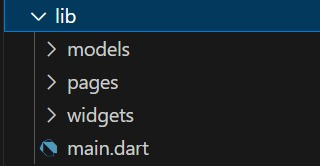

**Nama  : Fergie Fatah Ardiansyah  
  Kls   : TI-3G  
  NIM   : 2141720211   **

*Langkah 1: Siapkan project baru  *
   
  *Langkah 2: Mendefinisikan Route *
   
   
  *Langkah 3: Lengkapi Kode di main.dart  *
   
  *Langkah 4: Membuat data model *
   
  *Langkah 5: Lengkapi kode di class HomePage *
   
  *Langkah 6: Membuat ListView dan itemBuilder *
   
  *Langkah 7: Menambahkan aksi pada ListView *
   
  Output 
     
  *<u>Praktikum 3</u>  *
  *Langkah 1: Buat widget textSectio